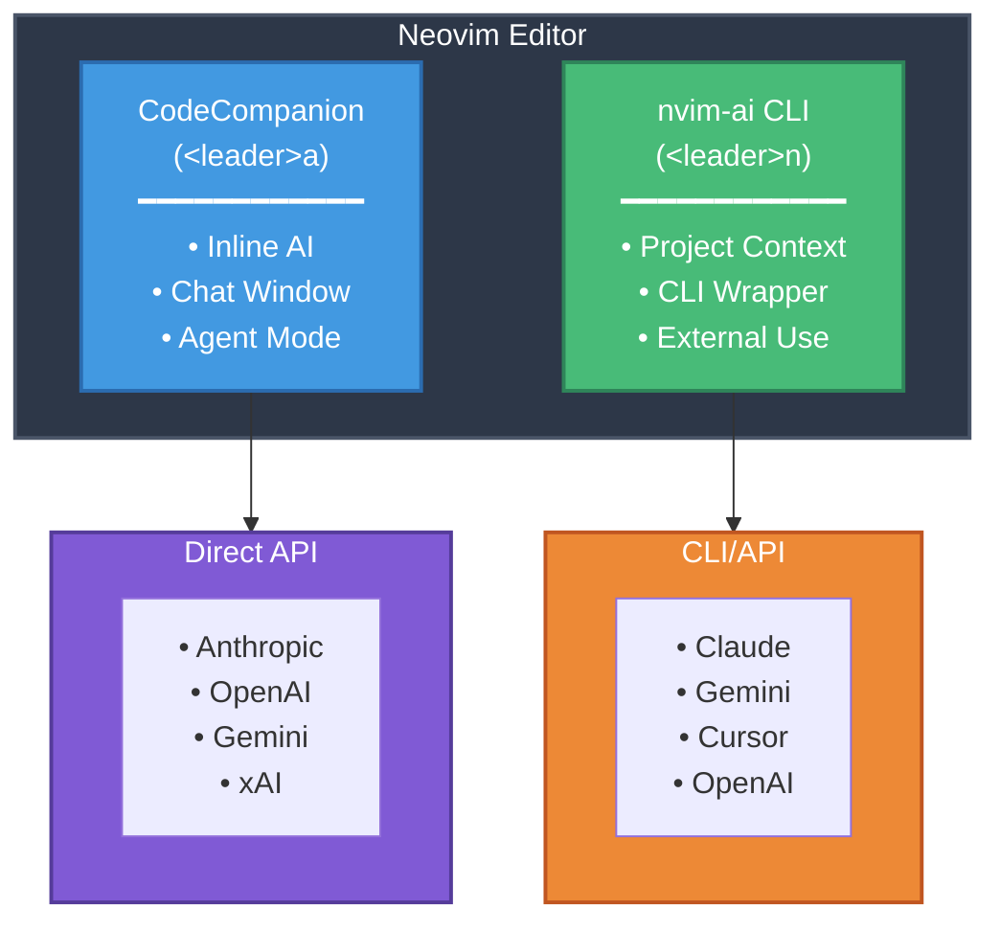

# AI Integration Guide

> 🌏 **한국어**: [AI 통합 가이드](../translations/ko/docs/AI_INTEGRATION.md)

Complete guide for integrating AI assistants into your Neovim workflow. This guide covers two complementary AI systems:

1. **CodeCompanion** (`<leader>a`) - Direct API integration for chat, inline suggestions, and agent mode
2. **nvim-ai CLI** (`<leader>n`) - Multi-provider CLI wrapper with full project context

## Architecture Overview



---

## 🎯 Which System Should I Use?

| Feature | CodeCompanion | nvim-ai CLI |
|---------|---------------|-------------|
| **Keymap** | `<Space>a` | `<Space>n` |
| **Providers** | Claude, OpenAI, Gemini, xAI, Codex | Claude, OpenAI, Gemini, Cursor |
| **API Mode** | ✅ HTTP API (API Key) | ✅ HTTP API |
| **CLI Mode** | ✅ ACP (API Key, No OAuth) | ✅ Shell wrapper |
| **Inline Suggestions** | ✅ | ❌ |
| **Project Context** | ✅ (via ACP) | ✅ |
| **External CLI** | ❌ | ✅ |
| **Agent Mode** | ✅ | ❌ |

**Recommendation**: Install both and use based on your needs!

---

# Part 1: CodeCompanion Setup

Unified AI integration supporting both **HTTP API** and **CLI modes** via Agent Client Protocol (ACP).

## 🔄 Supported Modes

### HTTP API Mode (Direct)
- Fast, stateless API calls
- Requires API keys
- Supported: Claude, OpenAI, Gemini, xAI

### CLI Mode (ACP - Agent Client Protocol)
- Stateful agent sessions with tool execution
- **API key authentication only (No OAuth for security)**
- File system operations, terminal access
- Supported: Claude (API key), Gemini, Codex

## Supported AI Models

### 1. **Anthropic Claude** (Default)
**HTTP API Mode:**
- claude-sonnet-4-20250514 (default)
- claude-opus-4-20250514
- claude-3-7-sonnet-20250219
- claude-3-5-sonnet-20241022

**CLI Mode (ACP):**
- Requires: `claude-code-acp` adapter
- Auth: **API key only** (`ANTHROPIC_API_KEY`) - **No OAuth for security**
- Features: File operations, tool execution, session management
- Note: OAuth authentication removed to prevent policy violations

### 2. **OpenAI**
- gpt-4o (default)
- gpt-4o-mini
- gpt-4-turbo
- gpt-4
- gpt-3.5-turbo

### 3. **Google Gemini**
**HTTP API Mode:**
- gemini-2.0-flash-exp (default)
- gemini-2.0-flash-thinking-exp
- gemini-exp-1206
- gemini-1.5-pro
- gemini-1.5-flash

**CLI Mode (ACP):**
- Requires: `@google/gemini-cli` (native ACP support)
- Auth: Google OAuth or API key (`GEMINI_API_KEY`)
- Auth methods: `oauth-personal`, `gemini-api-key`, `vertex-ai`

### 4. **xAI (Grok)**
**HTTP API Mode only:**
- grok-2-1212 (default)
- grok-2-vision-1212
- grok-beta

### 5. **OpenAI Codex**
**CLI Mode (ACP) only:**
- Requires: `@zed-industries/codex-acp`
- Auth: ChatGPT OAuth, OpenAI API key, or Codex API key
- Auth methods: `chatgpt`, `openai-api-key`, `codex-api-key`

---

## Installation Steps

### Quick Start (Automated)

**Run the installation script:**
```bash
./scripts/install-nvai.sh
```

This will:
1. Install ACP adapters (claude-code-acp, gemini-cli)
2. Configure providers (Claude, Gemini, OpenAI, etc.)
3. Set up API keys interactively (No OAuth)
4. Update your shell configuration

### Manual Installation

#### 1. Install ACP Adapters (for CLI mode)

```bash
# Claude ACP adapter
npm install -g @zed-industries/claude-code-acp

# Gemini CLI with ACP support
npm install -g @google/gemini-cli

# Codex ACP adapter (optional)
npm install -g @zed-industries/codex-acp
```

#### 2. Get API Keys (for HTTP API mode)

#### Anthropic Claude
1. Visit https://console.anthropic.com/
2. Go to Account Settings → API Keys
3. Click "Create Key"
4. Copy the API key

#### OpenAI
1. Visit https://platform.openai.com/
2. Go to API Keys
3. Click "Create new secret key"
4. Copy the API key

#### Google Gemini
1. Visit https://ai.google.dev/
2. Click "Get API key in Google AI Studio"
3. Create and copy the API key

#### xAI (Grok)
1. Visit https://console.x.ai/
2. Go to API Keys → "Create new API key"
3. Copy the API key

---

### 2. Set Environment Variables (for HTTP API mode)

#### macOS/Linux (Bash/Zsh)

Add to **~/.zshrc** or **~/.bashrc**:

```bash
# AI API Keys
export ANTHROPIC_API_KEY="sk-ant-..."  # Claude (API mode only)
export OPENAI_API_KEY="sk-..."         # OpenAI
export GEMINI_API_KEY="AIza..."        # Gemini (API + CLI mode)
export XAI_API_KEY="xai-..."           # xAI (Grok)
```

**Apply changes**:
```bash
source ~/.zshrc  # or source ~/.bashrc
```

#### Security Best Practices (1Password/Bitwarden)

**Using 1Password**:
```bash
# ~/.zshrc
export ANTHROPIC_API_KEY=$(op read "op://personal/Anthropic/credential")
export OPENAI_API_KEY=$(op read "op://personal/OpenAI/credential")
export GEMINI_API_KEY=$(op read "op://personal/Gemini/credential")
export XAI_API_KEY=$(op read "op://personal/xAI/credential")
```

**Using Bitwarden CLI**:
```bash
# ~/.zshrc
export ANTHROPIC_API_KEY=$(bw get password "Anthropic API")
export OPENAI_API_KEY=$(bw get password "OpenAI API")
export GEMINI_API_KEY=$(bw get password "Gemini API")
export XAI_API_KEY=$(bw get password "xAI API")
```

---

## Usage

### Default Keybindings

#### AI Chat
| Key | Function |
|-----|----------|
| `<Space>ac` | Open AI chat |
| `<Space>at` | Toggle AI chat |
| `<Space>aa` | AI actions menu |

#### Quick Commands
| Key | Function |
|-----|----------|
| `<Space>ae` | Explain code |
| `<Space>af` | Fix bugs |
| `<Space>ao` | Optimize code |
| `<Space>aT` | Generate tests |
| `<Space>ar` | Refactor code |

#### Inline AI
| Key | Function |
|-----|----------|
| `<Space>ai` | Inline AI suggestions |

#### Model Selection
| Key | Function |
|-----|----------|
| `<Space>am` | Select AI model (switches between HTTP API and CLI modes) |

### Switching Between HTTP API and CLI Modes

Edit `~/.config/nvim/config/nvim-ai-config.yaml`:

```yaml
# For HTTP API mode (fast, stateless)
default_provider: anthropic  # or openai, gemini, xai

# For CLI mode (stateful, with tool execution)
default_provider: claude     # Uses claude-code-acp (API key, no OAuth)
# OR
default_provider: anthropic  # Uses Anthropic HTTP API (API key)
# or
default_provider: gemini_cli # Uses Gemini CLI (OAuth or API key)
```

**Or use the model selector in nvim:**
```vim
<Space>am
# → Select:
#   - claude_code (Claude CLI)
#   - anthropic (Claude API)
#   - gemini_cli (Gemini CLI)
#   - gemini (Gemini API)
#   - openai (GPT)
#   - xai (Grok)
```

### Usage Examples

#### 1. Explain Code
```
1. Select code (Visual mode)
2. Press <Space>ae
3. AI explains the code
```

#### 2. Fix Bugs
```
1. Select code with bugs
2. Press <Space>af
3. AI suggests fixes
```

#### 3. Generate Tests
```
1. Select function
2. Press <Space>aT
3. AI generates test code
```

#### 4. Chat with AI
```
1. Press <Space>ac to open chat
2. Type your question
3. Press Enter or Ctrl+s to send
```

#### 5. Switch Models
```
1. Press <Space>am
2. Choose AI provider:
   - claude_code (Claude CLI - API Key)
   - anthropic (Claude API)
   - gemini_cli (Gemini CLI)
   - gemini (Gemini API)
   - openai (GPT)
   - xai (Grok)
   - gemini_cli (Agent)
   - cursor_agent (CLI)
```

---

## Slash Commands in Chat

Type `/` in chat window to access commands:

- `/explain` - Explain code
- `/fix` - Fix bugs
- `/optimize` - Optimize code
- `/tests` - Generate tests
- `/refactor` - Refactor code

---

## Troubleshooting

### API Keys Not Working

**Check 1**: Verify environment variables
```bash
echo $ANTHROPIC_API_KEY
echo $OPENAI_API_KEY
echo $GEMINI_API_KEY
echo $XAI_API_KEY
```

**Check 2**: Verify in Neovim
```vim
:lua print(vim.env.ANTHROPIC_API_KEY)
:lua print(vim.env.OPENAI_API_KEY)
```

**Solution**: If empty
```bash
# Restart terminal
source ~/.zshrc

# Restart Neovim
nvim
```

---

### Plugin Not Loading

**Check**:
```vim
:Lazy
```

**Solution**:
```vim
:Lazy sync
```

---

### "No adapter found" Error

**Cause**: Environment variables not set

**Solution**:
1. Verify API key environment variables
2. Restart terminal
3. Restart Neovim

---

## Advanced Configuration

### Add Custom Prompts

Edit **lua/plugins/ai.lua**:

```lua
prompt_library = {
  ["Custom Command"] = {
    strategy = "chat",
    description = "Your custom command",
    opts = {
      index = 10,
      is_slash_cmd = true,
    },
    prompts = {
      {
        role = "user",
        content = "Your custom prompt: {{selection}}",
      },
    },
  },
}
```

### Use Specific Models Only

In **lua/plugins/ai.lua**, remove unnecessary adapters:

```lua
adapters = {
  anthropic = function()
    -- Use Claude only
  end,
  -- Comment out gemini and xai
}
```

---

## Cost Management

### Monitor API Usage

#### Anthropic
- https://console.anthropic.com/settings/usage

#### OpenAI
- https://platform.openai.com/usage

#### Google Gemini
- https://ai.google.dev/pricing

#### xAI
- https://console.x.ai/billing

### Cost-Saving Tips

1. **Use smaller models**:
   - Claude: claude-3-5-sonnet (cheapest)
   - OpenAI: gpt-4o-mini or gpt-3.5-turbo (cheapest)
   - Gemini: gemini-1.5-flash (free tier available)
   - xAI: Check beta pricing

2. **Selective context**:
   - Select only relevant code
   - Use function selection instead of full files

3. **Use caching**:
   - Don't repeat identical questions
   - Reference previous conversations

---

# Part 2: nvim-ai CLI Setup

Multi-provider CLI wrapper for advanced AI integration.

## 🚀 Quick Start

### Automatic Installation (Recommended)

```bash
cd ~/.config/nvim
./scripts/install-nvai.sh
```

The installer will automatically:
- ✅ Check prerequisites
- ✅ Select and configure AI providers
- ✅ Set up API keys
- ✅ Configure PATH
- ✅ Run tests

### Manual Installation

#### 1. Initialize Configuration

```bash
~/.config/nvim/scripts/nvai --init
```

This creates `~/.config/nvim/config/nvim-ai-config.yaml` from the template.

#### 2. Install AI Providers

**Option A: Claude CLI (Recommended)**
```bash
npm install -g @anthropic-ai/claude-cli
```

**Option B: Gemini CLI**
```bash
pip3 install google-generativeai-cli
```

**Option C: OpenAI CLI (Optional)**
```bash
pip3 install openai-cli
```

**Option D: Cursor CLI (Optional)**
```bash
# Install cursor-agent CLI
npm install -g cursor-agent
```

**Option E: API Only (No CLI installation needed)**
```bash
# Just set environment variables
export ANTHROPIC_API_KEY="sk-ant-..."
export OPENAI_API_KEY="sk-..."
export GEMINI_API_KEY="AIza..."
export CURSOR_API_KEY="cur_..."
```

#### 3. Set Environment Variables

Add to **~/.zshrc** or **~/.bashrc**:

```bash
# nvim-ai CLI API Keys
export ANTHROPIC_API_KEY="sk-ant-..."  # Claude
export OPENAI_API_KEY="sk-..."         # OpenAI
export GEMINI_API_KEY="AIza..."        # Gemini
export CURSOR_API_KEY="cur_..."        # Cursor (optional)

# Add to PATH (optional, for system-wide access)
export PATH="$PATH:$HOME/.config/nvim/scripts"
```

Apply:
```bash
source ~/.zshrc  # or source ~/.bashrc
```

#### 4. Reload Neovim Plugin

```vim
:Lazy reload nvim-ai-cli
```

---

## 📖 Usage

### In Neovim

#### Commands

| Command | Description |
|---------|-------------|
| `:AIChat` | Open/toggle AI chat |
| `:AIChat <message>` | Send message directly |
| `:AIProvider` | Select AI provider |
| `:AIExplain` | Explain selected code |
| `:AIFix` | Suggest bug fixes |
| `:AIRefactor` | Suggest refactoring |
| `:AIOptimize` | Suggest optimizations |
| `:AITest` | Generate tests |
| `:AIAnalyze` | Analyze project |

#### Keybindings

| Key | Action | Mode |
|-----|--------|------|
| `<Space>nc` | Open AI chat | n, v |
| `<Space>nt` | Toggle chat window | n |
| `<Space>np` | Select provider | n |
| `<Space>ne` | Explain code | n, v |
| `<Space>nf` | Fix bugs | n, v |
| `<Space>nr` | Refactor code | n, v |
| `<Space>no` | Optimize code | n, v |
| `<Space>nq` | Custom prompt | n, v |
| `<Space>nT` | Generate tests | n |
| `<Space>nA` | Analyze project | n |

### CLI Usage (Outside Neovim)

```bash
# Simple prompt
nvai "Explain design patterns"

# With file context
nvai --file src/main.rs "Optimize this code"

# With project context
nvai --project . "Analyze architecture"

# Specific provider
nvai --provider claude "Review this code"

# Custom model and temperature
nvai --provider gemini \
     --model gemini-2.0-flash-exp \
     --temperature 0.3 \
     "Generate tests"

# From stdin
cat main.rs | nvai --selection - "Refactor this"
```

---

## ⚙️ Configuration

### Change Default Provider

Edit `~/.config/nvim/config/nvim-ai-config.yaml`:

```yaml
default_provider: claude  # or gemini, cursor, auto
```

### Adjust Window Size

Edit `~/.config/nvim/lua/plugins/ai-cli.lua`:

```lua
window = {
  position = "right",  # right|bottom|float
  width = 0.5,         # 50% of screen
  height = 0.9,        # 90% of screen
}
```

### Change Model

`~/.config/nvim/config/nvim-ai-config.yaml`:

```yaml
providers:
  claude:
    api:
      model: claude-opus-4-20250514  # Use Opus instead of Sonnet
      temperature: 0.3               # More deterministic
      max_tokens: 8192              # Longer responses
```

---

## 🐛 Troubleshooting

### "nvai: command not found"

```bash
# Check permissions
chmod +x ~/.config/nvim/scripts/nvai

# Add to PATH
export PATH="$PATH:$HOME/.config/nvim/scripts"

# Or use full path
~/.config/nvim/scripts/nvai "test"
```

### "No AI providers available"

```bash
# Check available providers
nvai --help

# Verify CLI installation
which claude
which openai-cli
which gemini
which cursor-agent

# Verify API keys
echo $ANTHROPIC_API_KEY
echo $OPENAI_API_KEY
echo $GEMINI_API_KEY
echo $CURSOR_API_KEY
```

### Chat Window Not Opening

```vim
" Reload plugin
:Lazy reload nvim-ai-cli

" Check errors
:messages

" Manual setup
:lua require('plugins.ai-cli').setup()
```

---

## 📚 Additional Resources

- **Quick Start Guide**: [QUICKSTART.md](QUICKSTART.md)
- **Language Support**: [LANGUAGES.md](LANGUAGES.md)
- **Troubleshooting**: [TROUBLESHOOTING.md](TROUBLESHOOTING.md)
- **CLI Help**: `nvai --help`
- **Configuration**: `~/.config/nvim/config/nvim-ai-config.yaml`
- **Template**: `config/nvim-ai-config.yaml.default` (tracked in Git, do not edit)

---

## 🎓 CodeCompanion vs nvim-ai CLI

### When to Use CodeCompanion?
- ✅ Need inline code suggestions
- ✅ Agent mode workflows
- ✅ Quick code fixes
- ✅ Prefer direct API integration

**Keymap**: `<Space>a`

### When to Use nvim-ai CLI?
- ✅ Need full project context
- ✅ Prefer CLI tools (claude, gemini)
- ✅ Switch between multiple AI providers
- ✅ Use from external CLI

**Keymap**: `<Space>n`

### Using Both Together
```vim
" CodeCompanion for inline suggestions
<Space>ac  " Open chat
<Space>ai  " Inline suggestions

" nvim-ai CLI for project analysis
<Space>nA  " Analyze entire project
<Space>ne  " Explain with file context
```

---

**Congratulations! 🎉** You now have two powerful AI systems in Neovim!

## References

- **CodeCompanion Documentation**: https://codecompanion.olimorris.dev/
- **Anthropic Documentation**: https://docs.anthropic.com/
- **OpenAI Documentation**: https://platform.openai.com/docs
- **Gemini Documentation**: https://ai.google.dev/docs
- **xAI Documentation**: https://docs.x.ai/
