# Markdown & Diagrams Guide

> 🌏 **한국어**: [마크다운 & 다이어그램 가이드](../translations/ko/docs/MARKDOWN_DIAGRAMS.md)

Complete guide for Markdown editing and Mermaid, PlantUML diagram previews in Neovim.

## Supported Features

### ✅ Markdown
- **In-Neovim Rendering**: Headers, code blocks, tables, checkboxes, links
- **Browser Preview**: Real-time sync, GitHub style
- **LaTeX**: Mathematical formula rendering
- **Callouts**: GitHub/Obsidian style alert blocks
- **TOC**: Automatic table of contents generation
- **Table Mode**: Automatic markdown table alignment

### ✅ Mermaid
- Flowcharts
- Sequence diagrams
- Gantt charts
- Class diagrams
- State diagrams
- ER diagrams
- Git graphs

### ✅ PlantUML
- UML diagrams
- Sequence diagrams
- Use case diagrams
- Class diagrams
- Activity diagrams
- Component diagrams
- State diagrams

---

## Installation Requirements

### 1. PlantUML Installation

#### macOS
```bash
# Install Java (required for PlantUML)
brew install openjdk

# Install PlantUML
brew install plantuml

# Verify installation
plantuml -version
```

#### Linux (Ubuntu/Debian)
```bash
# Install Java
sudo apt install default-jre

# Install PlantUML
sudo apt install plantuml

# Or download latest version
wget https://github.com/plantuml/plantuml/releases/download/v1.2024.3/plantuml-1.2024.3.jar
sudo mv plantuml-1.2024.3.jar /usr/local/bin/plantuml.jar

# Create execution script
echo '#!/bin/bash
java -jar /usr/local/bin/plantuml.jar "$@"' | sudo tee /usr/local/bin/plantuml
sudo chmod +x /usr/local/bin/plantuml
```

#### Using jar file directly
```bash
# Download PlantUML jar
wget https://github.com/plantuml/plantuml/releases/latest/download/plantuml.jar

# Specify path (in Neovim config)
# In lua/plugins/markdown.lua:
-- vim.g['plantuml_previewer#plantuml_jar_path'] = '/path/to/plantuml.jar'
```

---

### 2. Graphviz Installation (PlantUML dependency)

```bash
# macOS
brew install graphviz

# Linux
sudo apt install graphviz
```

---

## Keybindings

### Markdown Preview (with Mermaid support)
| Key | Function |
|-----|----------|
| `<Space>mp` | Open Markdown browser preview |
| `<Space>ms` | Stop preview |
| `<Space>mt` | Toggle preview |

### PlantUML
| Key | Function |
|-----|----------|
| `<Space>pl` | Render PlantUML (nvim-soil) |
| `<Space>pu` | Open PlantUML browser preview |
| `<Space>ps` | Save PlantUML image (PNG) |
| `<Space>pt` | Toggle PlantUML preview |

### Table Mode
| Key | Function |
|-----|----------|
| `<Space>tm` | Toggle table mode |

### TOC (Table of Contents)
| Key | Function |
|-----|----------|
| `<Space>mT` | Generate/update table of contents |

---

## Usage Examples

### 1. Mermaid Diagrams

**Flowchart**:
````markdown
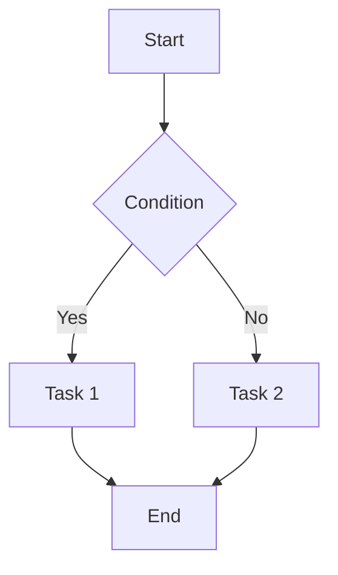
````

**Sequence Diagram**:
````markdown
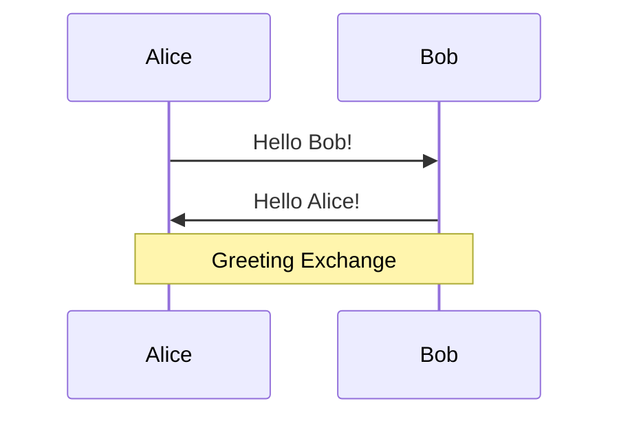
````

**Gantt Chart**:
````markdown
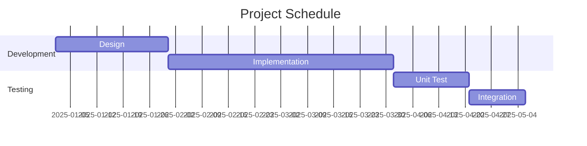
````

**Class Diagram**:
````markdown
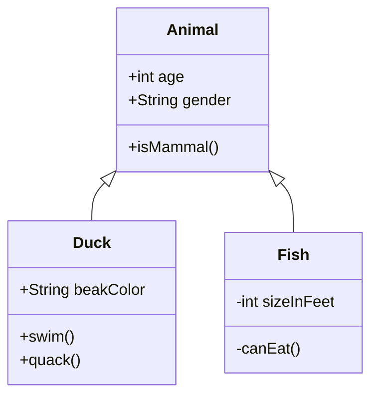
````

---

### 2. PlantUML Diagrams

**Create file**: `diagram.puml` or `diagram.plantuml`

**Sequence Diagram**:
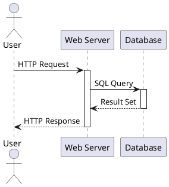

**Class Diagram**:
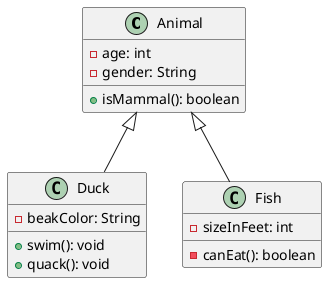

**Use Case Diagram**:
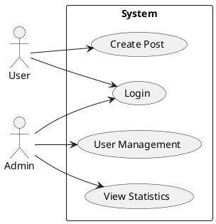

**Activity Diagram**:
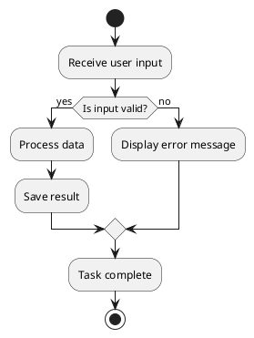

---

### 3. Markdown Writing Tips

#### Callouts (GitHub/Obsidian style)

```markdown
> [!NOTE]
> Useful information.

> [!TIP]
> Helpful tip!

> [!IMPORTANT]
> Important information.

> [!WARNING]
> Caution required.

> [!CAUTION]
> Potentially dangerous.
```

#### Checkboxes

```markdown
- [ ] Todo item 1
- [x] Completed task
- [-] In progress
```

#### Tables (Using Table Mode)

1. `<Space>tm` - Activate Table Mode
2. Start typing `|`:
```markdown
| Header 1 | Header 2 |
|----------|----------|
| Cell 1   | Cell 2   |
```
3. Table Mode auto-aligns

#### LaTeX Formulas

```markdown
Inline: $E = mc^2$

Block:
$$
\int_{a}^{b} f(x) dx = F(b) - F(a)
$$
```

---

## Workflows

### Markdown Writing Workflow

1. **Create Markdown file**: `nvim README.md`
2. **Check real-time rendering**: Auto-render in Normal mode
3. **Edit**: Switch to Insert mode to see source
4. **Browser preview**: `<Space>mp` (includes Mermaid diagrams)

### PlantUML Workflow

1. **Create PlantUML file**: `nvim diagram.puml`
2. **Write diagram**: Use UML syntax
3. **Preview**: `<Space>pu` (browser opens automatically)
4. **Auto-update on save**: Preview updates when file is saved
5. **Save image**: `<Space>ps` (save as PNG file)

### Mixed Workflow

**Include diagrams in Markdown**:
````markdown
# Project Documentation

## System Architecture

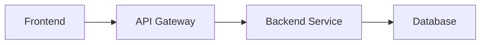

## Detailed Sequence

See [sequence.puml](./sequence.puml) for detailed sequence
````

---

## Troubleshooting

### PlantUML: "Cannot find plantuml"

**Cause**: PlantUML is not in PATH

**Solution**:
```bash
# Check installation
which plantuml

# If not installed
brew install plantuml  # macOS
sudo apt install plantuml  # Linux
```

---

### PlantUML: "Cannot find Graphviz"

**Cause**: Graphviz not installed

**Solution**:
```bash
brew install graphviz  # macOS
sudo apt install graphviz  # Linux
```

---

### Markdown Preview: Browser doesn't open

**Solution**:
```bash
# Reinstall plugin
nvim
:Lazy sync
:call mkdp#util#install()
```

---

### Mermaid doesn't render

**Check**:
1. Run `<Space>mp` in markdown file
2. Check in browser (in-Neovim rendering doesn't support Mermaid)

---

### PlantUML preview doesn't update

**Solution**:
```bash
# Refresh browser
# Or restart preview
<Space>ps  # Stop
<Space>pu  # Open again
```

---

## Advanced Features

### PlantUML Theme Customization

```plantuml
@startuml
!theme blueprint
' Or: amiga, aws-orange, black-knight, bluegray, etc.

class Example {
  + method()
}
@enduml
```

Available themes: https://plantuml.com/theme

---

### Mermaid Theme Configuration

````markdown
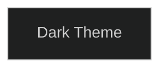
````

Theme options: `default`, `dark`, `forest`, `neutral`

---

### Complex PlantUML Diagrams

**Deployment Diagram**:
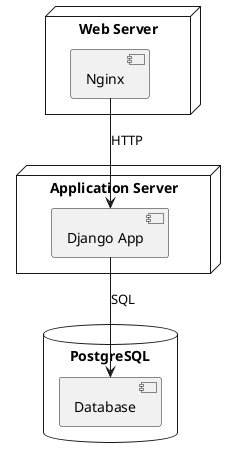

**Component Diagram**:
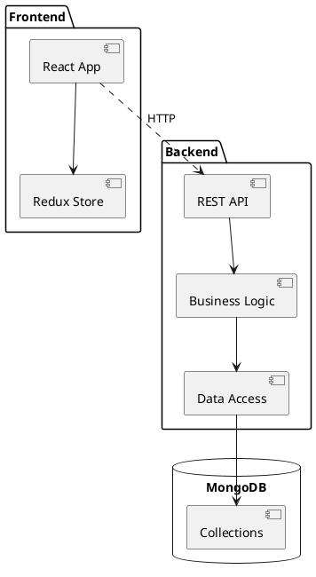

---

## Resources

### Mermaid
- Official documentation: https://mermaid.js.org/
- Live Editor: https://mermaid.live/
- Examples: https://mermaid.js.org/syntax/examples.html

### PlantUML
- Official site: https://plantuml.com/
- Online editor: http://www.plantuml.com/plantuml/
- Guide: https://plantuml.com/guide

### Markdown
- CommonMark: https://commonmark.org/
- GitHub Flavored Markdown: https://github.github.com/gfm/

---

## Keybindings Summary

| Feature | Key | Description |
|---------|-----|-------------|
| **Markdown Preview** | `<Space>mp` | Open browser preview (includes Mermaid) |
| | `<Space>ms` | Stop preview |
| | `<Space>mt` | Toggle preview |
| **PlantUML** | `<Space>pl` | Render (nvim-soil, auto-opens image viewer) |
| | `<Space>pu` | Open browser preview |
| | `<Space>ps` | Save PNG |
| | `<Space>pt` | Toggle preview |
| **Table Mode** | `<Space>tm` | Auto-align table mode |
| **TOC** | `<Space>mT` | Generate table of contents |

---

**Congratulations! 🎉** You can now use Markdown, Mermaid, and PlantUML in Neovim!

Next steps:
1. Open markdown file: `nvim README.md`
2. Add Mermaid diagram
3. Check browser preview with `<Space>mp`
4. Create PlantUML file: `nvim diagram.puml`
5. View live preview with `<Space>pu`
