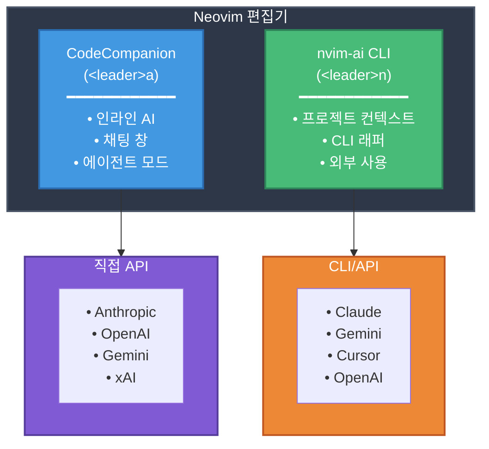

# AI 통합 가이드

Neovim 워크플로우에 AI 어시스턴트를 통합하는 완전한 가이드입니다. 두 가지 상호 보완적인 AI 시스템을 다룹니다:

1. **CodeCompanion** (`<leader>a`) - 채팅, 인라인 제안, 에이전트 모드를 위한 직접 API 통합
2. **nvim-ai CLI** (`<leader>n`) - 전체 프로젝트 컨텍스트를 제공하는 멀티 제공자 CLI 래퍼

## 아키텍처 개요



---

## 🎯 어떤 시스템을 사용해야 할까요?

| 기능 | CodeCompanion | nvim-ai CLI |
|---------|---------------|-------------|
| **키맵** | `<Space>a` | `<Space>n` |
| **제공자** | Claude, OpenAI, Gemini, xAI, Codex | Claude, OpenAI, Gemini, Cursor |
| **API 모드** | ✅ HTTP API (API Key) | ✅ HTTP API |
| **CLI 모드** | ✅ ACP (API Key, OAuth 제거) | ✅ Shell 래퍼 |
| **인라인 제안** | ✅ | ❌ |
| **프로젝트 컨텍스트** | ✅ (ACP 경유) | ✅ |
| **외부 CLI** | ❌ | ✅ |
| **에이전트 모드** | ✅ | ❌ |

**권장사항**: 두 시스템을 모두 설치하고 필요에 따라 사용하세요!

---

# 파트 1: CodeCompanion 설정

**HTTP API** 및 ACP(Agent Client Protocol)를 통한 **CLI 모드**를 모두 지원하는 통합 AI 통합.

## 🔄 지원되는 모드

### HTTP API 모드 (직접)
- 빠르고 상태 비저장 API 호출
- API 키 필요
- 지원: Claude, OpenAI, Gemini, xAI

### CLI 모드 (ACP - Agent Client Protocol)
- 도구 실행을 포함한 상태 저장 에이전트 세션
- **API 키 인증만 사용 (보안을 위해 OAuth 제거)**
- 파일 시스템 작업, 터미널 액세스
- 지원: Claude (API 키), Gemini, Codex

## 지원되는 AI 모델

### 1. **Anthropic Claude** (기본값)
**HTTP API 모드:**
- claude-sonnet-4-20250514 (기본값)
- claude-opus-4-20250514
- claude-3-7-sonnet-20250219
- claude-3-5-sonnet-20241022

**CLI 모드 (ACP):**
- 필수: `claude-code-acp` 어댑터
- 인증: **API 키만 사용** (`ANTHROPIC_API_KEY`) - **보안을 위해 OAuth 제거**
- 기능: 파일 작업, 도구 실행, 세션 관리
- 참고: 정책 위반 방지를 위해 OAuth 인증 제거됨

### 2. **OpenAI**
- gpt-4o (기본값)
- gpt-4o-mini
- gpt-4-turbo
- gpt-4
- gpt-3.5-turbo

### 3. **Google Gemini**
**HTTP API 모드:**
- gemini-2.0-flash-exp (기본값)
- gemini-2.0-flash-thinking-exp
- gemini-exp-1206
- gemini-1.5-pro
- gemini-1.5-flash

**CLI 모드 (ACP):**
- 필수: `@google/gemini-cli` (네이티브 ACP 지원)
- 인증: Google OAuth 또는 API 키 (`GEMINI_API_KEY`)
- 인증 방법: `oauth-personal`, `gemini-api-key`, `vertex-ai`

### 4. **xAI (Grok)**
**HTTP API 모드만:**
- grok-2-1212 (기본값)
- grok-2-vision-1212
- grok-beta

### 5. **OpenAI Codex**
**CLI 모드 (ACP)만:**
- 필수: `@zed-industries/codex-acp`
- 인증: ChatGPT OAuth, OpenAI API 키, 또는 Codex API 키
- 인증 방법: `chatgpt`, `openai-api-key`, `codex-api-key`

---

## 설치 단계

### 빠른 시작 (자동)

**설치 스크립트 실행:**
```bash
./scripts/install-nvai.sh
```

다음 작업이 자동으로 수행됩니다:
1. ACP 어댑터 설치 (claude-code-acp, gemini-cli)
2. 제공자 구성 (Claude, Gemini, OpenAI 등)
3. 대화식으로 API 키 설정 (OAuth 없음)
4. 셸 구성 업데이트

### 수동 설치

#### 1. ACP 어댑터 설치 (CLI 모드용)

```bash
# Claude ACP 어댑터
npm install -g @zed-industries/claude-code-acp

# ACP 지원이 포함된 Gemini CLI
npm install -g @google/gemini-cli

# Codex ACP 어댑터 (선택사항)
npm install -g @zed-industries/codex-acp
```

#### 2. API 키 발급 (HTTP API 모드용)

#### Anthropic Claude
1. https://console.anthropic.com/ 방문
2. Account Settings → API Keys로 이동
3. "Create Key" 클릭
4. API 키 복사

#### OpenAI
1. https://platform.openai.com/ 방문
2. API Keys로 이동
3. "Create new secret key" 클릭
4. API 키 복사

#### Google Gemini
1. https://ai.google.dev/ 방문
2. "Get API key in Google AI Studio" 클릭
3. API 키 생성 및 복사

#### xAI (Grok)
1. https://console.x.ai/ 방문
2. API Keys → "Create new API key"로 이동
3. API 키 복사

---

### 2. 환경 변수 설정 (HTTP API 모드용)

#### macOS/Linux (Bash/Zsh)

**~/.zshrc** 또는 **~/.bashrc**에 추가:

```bash
# AI API 키
export ANTHROPIC_API_KEY="sk-ant-..."  # Claude (API 모드만)
export OPENAI_API_KEY="sk-..."         # OpenAI
export GEMINI_API_KEY="AIza..."        # Gemini (API + CLI 모드)
export XAI_API_KEY="xai-..."           # xAI (Grok)
```

**변경사항 적용**:
```bash
source ~/.zshrc  # 또는 source ~/.bashrc
```

#### 보안 모범 사례 (1Password/Bitwarden)

**1Password 사용**:
```bash
# ~/.zshrc
export ANTHROPIC_API_KEY=$(op read "op://personal/Anthropic/credential")
export OPENAI_API_KEY=$(op read "op://personal/OpenAI/credential")
export GEMINI_API_KEY=$(op read "op://personal/Gemini/credential")
export XAI_API_KEY=$(op read "op://personal/xAI/credential")
```

**Bitwarden CLI 사용**:
```bash
# ~/.zshrc
export ANTHROPIC_API_KEY=$(bw get password "Anthropic API")
export OPENAI_API_KEY=$(bw get password "OpenAI API")
export GEMINI_API_KEY=$(bw get password "Gemini API")
export XAI_API_KEY=$(bw get password "xAI API")
```

---

## 사용법

### 기본 키바인딩

#### AI 채팅
| 키 | 기능 |
|-----|----------|
| `<Space>ac` | AI 채팅 열기 |
| `<Space>at` | AI 채팅 토글 |
| `<Space>aa` | AI 액션 메뉴 |

#### 빠른 명령
| 키 | 기능 |
|-----|----------|
| `<Space>ae` | 코드 설명 |
| `<Space>af` | 버그 수정 |
| `<Space>ao` | 코드 최적화 |
| `<Space>aT` | 테스트 생성 |
| `<Space>ar` | 코드 리팩토링 |

#### 인라인 AI
| 키 | 기능 |
|-----|----------|
| `<Space>ai` | 인라인 AI 제안 |

#### 모델 선택
| 키 | 기능 |
|-----|----------|
| `<Space>am` | AI 모델 선택 (HTTP API와 CLI 모드 간 전환) |

### HTTP API와 CLI 모드 간 전환

`~/.config/nvim/config/nvim-ai-config.yaml` 편집:

```yaml
# HTTP API 모드용 (빠르고, 상태 비저장)
default_provider: anthropic  # 또는 openai, gemini, xai

# CLI 모드용 (상태 저장, 도구 실행 포함)
default_provider: claude     # claude-code-acp 사용 (API 키, OAuth 없음)
# 또는
default_provider: anthropic  # Anthropic HTTP API 사용 (API 키)
# 또는
default_provider: gemini_cli # Gemini CLI 사용 (OAuth 또는 API 키)
```

**또는 nvim에서 모델 선택기 사용:**
```vim
<Space>am
# → 선택:
#   - claude_code (Claude CLI)
#   - anthropic (Claude API)
#   - gemini_cli (Gemini CLI)
#   - gemini (Gemini API)
#   - openai (GPT)
#   - xai (Grok)
```

### 사용 예시

#### 1. 코드 설명
```
1. 코드 선택 (Visual 모드)
2. <Space>ae 누르기
3. AI가 코드를 설명합니다
```

#### 2. 버그 수정
```
1. 버그가 있는 코드 선택
2. <Space>af 누르기
3. AI가 수정 사항을 제안합니다
```

#### 3. 테스트 생성
```
1. 함수 선택
2. <Space>aT 누르기
3. AI가 테스트 코드를 생성합니다
```

#### 4. AI와 채팅
```
1. <Space>ac를 눌러 채팅 열기
2. 질문 입력
3. Enter 또는 Ctrl+s를 눌러 전송
```

#### 5. 모델 전환
```
1. <Space>am 누르기
2. AI 제공자 선택:
   - anthropic (Claude)
   - openai (GPT)
   - gemini (Gemini)
   - xai (Grok)
   - claude_code (Agent)
   - codex (CLI)
   - gemini_cli (Agent)
   - cursor_agent (CLI)
```

---

## 채팅 내 슬래시 명령

채팅 창에서 `/`를 입력하여 명령에 액세스:

- `/explain` - 코드 설명
- `/fix` - 버그 수정
- `/optimize` - 코드 최적화
- `/tests` - 테스트 생성
- `/refactor` - 코드 리팩토링

---

## 문제 해결

### API 키가 작동하지 않음

**확인 1**: 환경 변수 확인
```bash
echo $ANTHROPIC_API_KEY
echo $OPENAI_API_KEY
echo $GEMINI_API_KEY
echo $XAI_API_KEY
```

**확인 2**: Neovim에서 확인
```vim
:lua print(vim.env.ANTHROPIC_API_KEY)
:lua print(vim.env.OPENAI_API_KEY)
```

**해결책**: 비어있는 경우
```bash
# 터미널 재시작
source ~/.zshrc

# Neovim 재시작
nvim
```

---

### 플러그인이 로드되지 않음

**확인**:
```vim
:Lazy
```

**해결책**:
```vim
:Lazy sync
```

---

### "No adapter found" 오류

**원인**: 환경 변수가 설정되지 않음

**해결책**:
1. API 키 환경 변수 확인
2. 터미널 재시작
3. Neovim 재시작

---

## 고급 설정

### 사용자 정의 프롬프트 추가

**lua/plugins/ai.lua** 편집:

```lua
prompt_library = {
  ["Custom Command"] = {
    strategy = "chat",
    description = "Your custom command",
    opts = {
      index = 10,
      is_slash_cmd = true,
    },
    prompts = {
      {
        role = "user",
        content = "Your custom prompt: {{selection}}",
      },
    },
  },
}
```

### 특정 모델만 사용

**lua/plugins/ai.lua**에서 불필요한 어댑터 제거:

```lua
adapters = {
  anthropic = function()
    -- Claude만 사용
  end,
  -- gemini와 xai 주석 처리
}
```

---

## 비용 관리

### API 사용량 모니터링

#### Anthropic
- https://console.anthropic.com/settings/usage

#### OpenAI
- https://platform.openai.com/usage

#### Google Gemini
- https://ai.google.dev/pricing

#### xAI
- https://console.x.ai/billing

### 비용 절약 팁

1. **더 작은 모델 사용**:
   - Claude: claude-3-5-sonnet (가장 저렴)
   - OpenAI: gpt-4o-mini 또는 gpt-3.5-turbo (가장 저렴)
   - Gemini: gemini-1.5-flash (무료 티어 사용 가능)
   - xAI: 베타 가격 확인

2. **선택적 컨텍스트**:
   - 관련 코드만 선택
   - 전체 파일 대신 함수 선택 사용

3. **캐싱 활용**:
   - 동일한 질문 반복하지 않기
   - 이전 대화 참조

---

# 파트 2: nvim-ai CLI 설정

고급 AI 통합을 위한 멀티 제공자 CLI 래퍼.

## 🚀 빠른 시작

### 자동 설치 (권장)

```bash
cd ~/.config/nvim
./scripts/install-nvai.sh
```

설치 프로그램이 자동으로 다음을 수행합니다:
- ✅ 필수 구성 요소 확인
- ✅ AI 제공자 선택 및 구성
- ✅ API 키 설정
- ✅ PATH 구성
- ✅ 테스트 실행

### 수동 설치

#### 1. 구성 초기화

```bash
~/.config/nvim/scripts/nvai --init
```

이렇게 하면 `~/.config/nvim/config/nvim-ai-config.yaml`이 템플릿에서 생성됩니다.

#### 2. AI 제공자 설치

**옵션 A: Claude CLI (권장)**
```bash
npm install -g @anthropic-ai/claude-cli
```

**옵션 B: Gemini CLI**
```bash
pip3 install google-generativeai-cli
```

**옵션 C: OpenAI CLI (선택사항)**
```bash
pip3 install openai-cli
```

**옵션 D: Cursor CLI (선택사항)**
```bash
# cursor-agent CLI 설치
npm install -g cursor-agent
```

**옵션 E: API만 사용 (CLI 설치 불필요)**
```bash
# 환경 변수만 설정
export ANTHROPIC_API_KEY="sk-ant-..."
export OPENAI_API_KEY="sk-..."
export GEMINI_API_KEY="AIza..."
export CURSOR_API_KEY="cur_..."
```

#### 3. 환경 변수 설정

**~/.zshrc** 또는 **~/.bashrc**에 추가:

```bash
# nvim-ai CLI API Keys
export ANTHROPIC_API_KEY="sk-ant-..."  # Claude
export OPENAI_API_KEY="sk-..."         # OpenAI
export GEMINI_API_KEY="AIza..."        # Gemini
export CURSOR_API_KEY="cur_..."        # Cursor (선택사항)

# PATH에 추가 (선택사항, 시스템 전체 액세스용)
export PATH="$PATH:$HOME/.config/nvim/scripts"
```

적용:
```bash
source ~/.zshrc  # 또는 source ~/.bashrc
```

#### 4. Neovim 플러그인 다시 로드

```vim
:Lazy reload nvim-ai-cli
```

---

## 📖 사용법

### Neovim 내에서

#### 명령

| 명령 | 설명 |
|---------|-------------|
| `:AIChat` | AI 채팅 열기/토글 |
| `:AIChat <message>` | 메시지 직접 전송 |
| `:AIProvider` | AI 제공자 선택 |
| `:AIExplain` | 선택한 코드 설명 |
| `:AIFix` | 버그 수정 제안 |
| `:AIRefactor` | 리팩토링 제안 |
| `:AIOptimize` | 최적화 제안 |
| `:AITest` | 테스트 생성 |
| `:AIAnalyze` | 프로젝트 분석 |

#### 키바인딩

| 키 | 동작 | 모드 |
|-----|--------|------|
| `<Space>nc` | AI 채팅 열기 | n, v |
| `<Space>nt` | 채팅 창 토글 | n |
| `<Space>np` | 제공자 선택 | n |
| `<Space>ne` | 코드 설명 | n, v |
| `<Space>nf` | 버그 수정 | n, v |
| `<Space>nr` | 코드 리팩토링 | n, v |
| `<Space>no` | 코드 최적화 | n, v |
| `<Space>nq` | 사용자 정의 프롬프트 | n, v |
| `<Space>nT` | 테스트 생성 | n |
| `<Space>nA` | 프로젝트 분석 | n |

### CLI 사용 (Neovim 외부)

```bash
# 간단한 프롬프트
nvai "디자인 패턴 설명"

# 파일 컨텍스트와 함께
nvai --file src/main.rs "이 코드 최적화"

# 프로젝트 컨텍스트와 함께
nvai --project . "아키텍처 분석"

# 특정 제공자
nvai --provider claude "코드 리뷰"

# 사용자 정의 모델 및 temperature
nvai --provider gemini \
     --model gemini-2.0-flash-exp \
     --temperature 0.3 \
     "테스트 생성"

# stdin에서
cat main.rs | nvai --selection - "이것 리팩토링"
```

---

## ⚙️ 구성

### 기본 제공자 변경

`~/.config/nvim/config/nvim-ai-config.yaml` 편집:

```yaml
default_provider: claude  # 또는 gemini, cursor, auto
```

### 창 크기 조정

`~/.config/nvim/lua/plugins/ai-cli.lua` 편집:

```lua
window = {
  position = "right",  # right|bottom|float
  width = 0.5,         # 화면의 50%
  height = 0.9,        # 화면의 90%
}
```

### 모델 변경

`~/.config/nvim/config/nvim-ai-config.yaml`:

```yaml
providers:
  claude:
    api:
      model: claude-opus-4-20250514  # Sonnet 대신 Opus 사용
      temperature: 0.3               # 더 결정론적
      max_tokens: 8192              # 더 긴 응답
```

---

## 🐛 문제 해결

### "nvai: command not found"

```bash
# 권한 확인
chmod +x ~/.config/nvim/scripts/nvai

# PATH에 추가
export PATH="$PATH:$HOME/.config/nvim/scripts"

# 또는 전체 경로 사용
~/.config/nvim/scripts/nvai "test"
```

### "No AI providers available"

```bash
# 사용 가능한 제공자 확인
nvai --help

# CLI 설치 확인
which claude
which openai-cli
which gemini
which cursor-agent

# API 키 확인
echo $ANTHROPIC_API_KEY
echo $OPENAI_API_KEY
echo $GEMINI_API_KEY
echo $CURSOR_API_KEY
```

### 채팅 창이 열리지 않음

```vim
" 플러그인 다시 로드
:Lazy reload nvim-ai-cli

" 오류 확인
:messages

" 수동 설정
:lua require('plugins.ai-cli').setup()
```

---

## 📚 리소스

- **CLI 도움말**: `nvai --help`
- **구성**: `~/.config/nvim/config/nvim-ai-config.yaml`
- **템플릿**: `config/nvim-ai-config.yaml.default` (Git에 포함, 수정하지 않음)

---

## 🎓 CodeCompanion vs nvim-ai CLI

### CodeCompanion을 언제 사용할까요?
- ✅ 인라인 코드 제안 필요
- ✅ 에이전트 모드 워크플로우
- ✅ 빠른 코드 수정
- ✅ 직접 API 통합 선호

**키맵**: `<Space>a`

### nvim-ai CLI를 언제 사용할까요?
- ✅ 전체 프로젝트 컨텍스트 필요
- ✅ CLI 도구 선호 (claude, gemini)
- ✅ 여러 AI 제공자 간 전환
- ✅ 외부 CLI에서 사용

**키맵**: `<Space>n`

### 함께 사용하기
```vim
" 인라인 제안을 위한 CodeCompanion
<Space>ac  " 채팅 열기
<Space>ai  " 인라인 제안

" 프로젝트 분석을 위한 nvim-ai CLI
<Space>nA  " 전체 프로젝트 분석
<Space>ne  " 파일 컨텍스트로 설명
```

---

**축하합니다! 🎉** 이제 Neovim에서 두 개의 강력한 AI 시스템을 사용할 수 있습니다!

## 참고 자료

- **CodeCompanion 문서**: https://codecompanion.olimorris.dev/
- **Anthropic 문서**: https://docs.anthropic.com/
- **OpenAI 문서**: https://platform.openai.com/docs
- **Gemini 문서**: https://ai.google.dev/docs
- **xAI 문서**: https://docs.x.ai/
